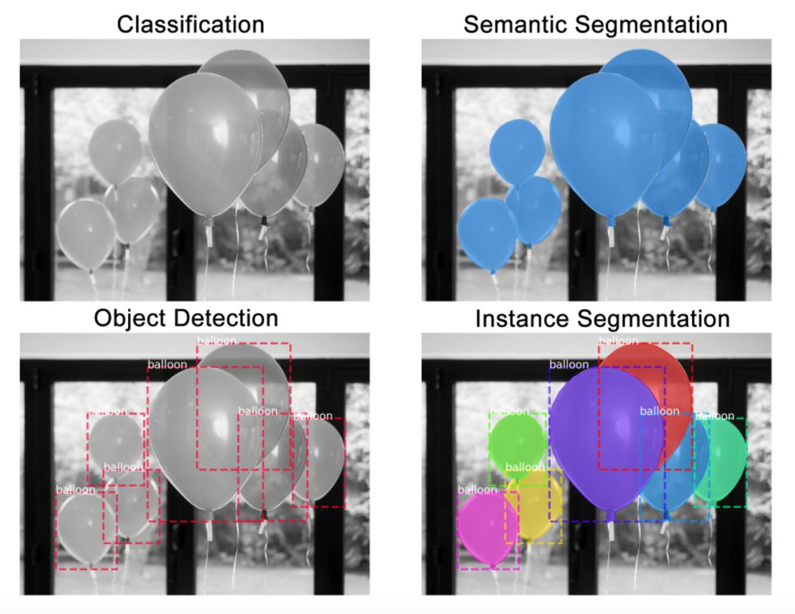
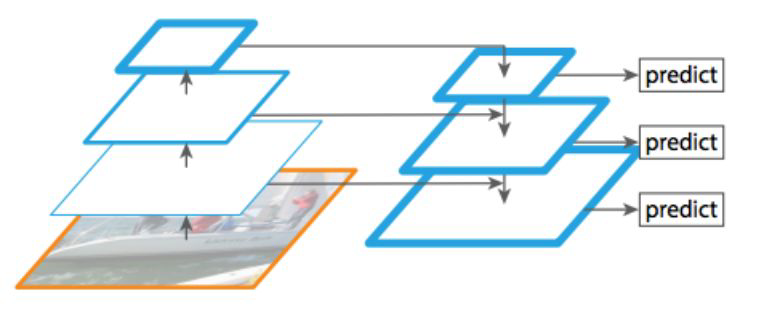

# balloon
先理解Mask R-CNN的工作原理,然后构建颜色填充器应用.[code](https://github.com/matterport/Mask_RCNN/tree/master/samples/balloon).

实例分割是一种在像素层面识别目标轮廓的任务,相比其他相关任务,实例分割是较难解决的计算机视觉任务之一:

- 分类:这张图像中有一个气球
- 语义分割:这些全是气球像素
- 目标检测:这张图像中的这些位置上有7个气球
- 实例分割:这些位置上有7个气球,并且这些像素分别属于每个气球

## Mask R-CNN
Mask R-CNN是一个两阶段的框架,第一个阶段扫描图像并生成提议(proposals,即有可能包含一个目标的区域),第二阶段分类提议并生成边界框和掩码.Mask R-CNN扩展自Faster R-CNN,由同一作者在去年提出.Faster R-CNN是一个流行的目标检测框架,Mask R-CNN将其扩展为实例分割框架.

### 主干架构
主干网络是一个标准的卷积神经网络(通常来说是ResNet50和ResNet101),作为特征提取器.底层检测的是低级特征(边缘和角等),较高层检测的是更高级的特征(汽车,人,天空等).

经过主干网络的前向传播,图像从`1024x1024x3(RGB)`的张量被转换成形状为`32x32x2048`的特征图.该特征图将作为下一个阶段的输入.

>代码提示:主干网络在`resnet_graph()`函数中.代码支持`ResNet50`和`ResNet101`.

特征金字塔网络(FPN)是对主干网络的扩展,可以在多个尺度上更好地表征目标.FPN通过添加第二个金字塔提升了标准特征提取金字塔的性能,第二个金字塔可以从第一个金字塔选择高级特征并传递到底层上.通过这个过程,它允许每一级的特征都可以和高级,低级特征互相结合.

>代码提示:FPN在`MaskRCNN.build()`中创建,位于构建ResNet的部分之后.

Mask R-CNN实现中使用的是`ResNet101+FPN`主干架构.

### 区域建议网络(RPN)
RPN是一个轻量的神经网络,它用滑动窗口来扫描图像,并寻找存在目标的区域.RPN扫描的区域被称为anchor,在不同的尺寸和长宽比下,图像上会有将近20万个anchor,并且它们互相重叠以尽可能地覆盖图像.

>代码提示:RPN在`rpn_graph()`中创建.anchor的尺度和长宽比由`config.py`中的`RPN_ANCHOR_SCALES`和`RPN_ANCHOR_RATIOS`控制.

RPN为每个anchor生成两个输出:

1. anchor类别:前景或背景(FG/BG).前景类别意味着可能存在一个目标在anchor box中
2. 边框精调:前景anchor(或称正anchor)可能并没有完美地位于目标的中心.因此,RPN评估了delta输出`(x,y,宽,高)`的变化百分数,以精调anchor box来更好地拟合目标

使用RPN的预测,我们可以选出最好地包含了目标的anchor,并对其位置和尺寸进行精调.如果有多个anchor互相重叠,我们将保留拥有最高前景分数的anchor,并舍弃余下的(非极大值抑制).然后我们就得到了最终的区域建议,并将其传递到下一个阶段.

>代码提示:`ProposalLayer`是一个自定义的Keras层,可以读取RPN的输出,选取最好的anchor,并应用边框精调.

### ROI分类器和边界框回归器
这个阶段是在由RPN提出的ROI上运行的.正如RPN一样,它为每个ROI生成了两个输出:

1. 类别:ROI中的目标的类别.和RPN不同(两个类别,前景或背景),这个网络更深并且可以将区域分类为具体的类别(人,车,椅子等).它还可以生成一个背景类别,然后就可以弃用ROI了
2. 边框精调:和RPN的原理类似,它的目标是进一步精调边框的位置和尺寸以将目标封装

>代码提示:分类器和边框回归器已在`fpn_classifier_graph()`中创建.

#### ROI池化
在我们继续之前,需要先解决一些问题.分类器并不能很好地处理多种输入尺寸.它们通常只能处理固定的输入尺寸.但是,由于RPN中的边框精调步骤,ROI框可以有不同的尺寸.因此,我们需要用ROI池化来解决这个问题.

ROI池化是指裁剪出特征图的一部分,然后将其重新调整为固定的尺寸.这个过程实际上和裁剪图片并将其缩放是相似的(在实现细节上有所不同).

Mask R-CNN的作者提出了一种方法ROIAlign,在特征图的不同点采样,并应用双线性插值.在我们的实现中,为简单起见,我们使用TensorFlow的`crop_and_resize`函数来实现这个过程.

>代码提示:ROI池化在类`PyramidROIAlign`中实现.

### 分割掩码
到此为止,我们得到的正是一个用于目标检测的Faster R-CNN.而分割掩码网络正是Mask R-CNN引入的附加网络.

掩码分支是一个卷积网络,取ROI分类器选择的正区域为输入,并生成它们的掩码.其生成的掩码是低分辨率的:`28x28`像素.但它们是由浮点数表示的软掩码,相对于二进制掩码有更多的细节.掩码的小尺寸属性有助于保持掩码分支网络的轻量性.在训练过程中,我们将真实的掩码缩小为`28x28`来计算损失函数,在推断过程中,我们将预测的掩码放大为ROI边框的尺寸以给出最终的掩码结果,每个目标有一个掩码.

>代码提示:掩码分支网络在`build_fpn_mask_graph()`中.